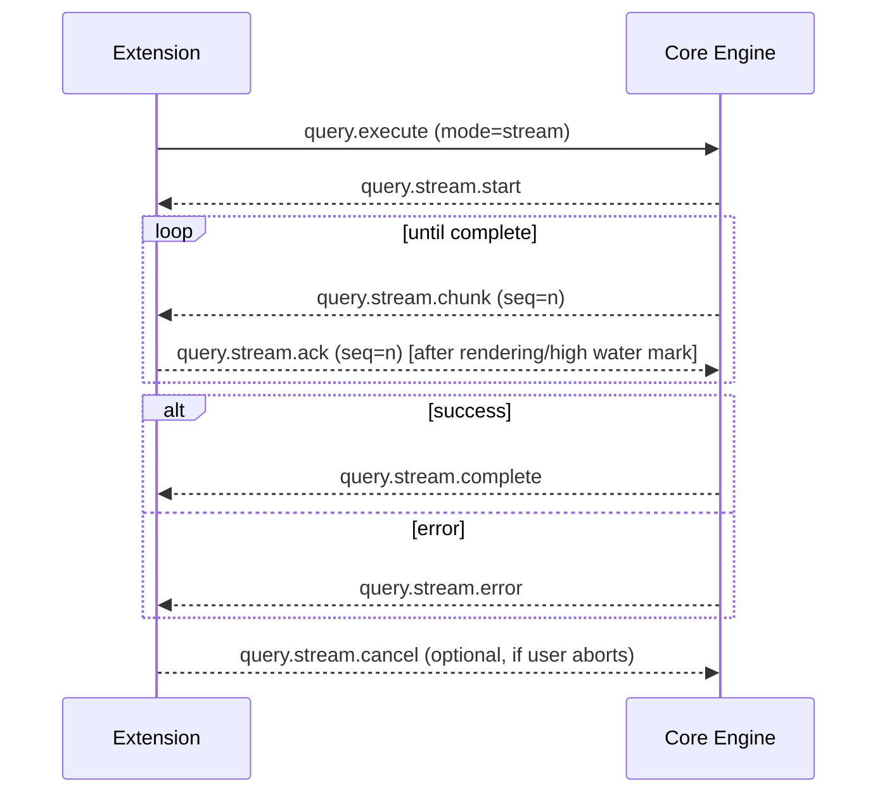

# Query Streaming Protocol (Draft)

> Owner: FluxGrid team  
> Status: Draft – ready for review  
> Related issues: #10 (Design query streaming protocol)

## Goals

- Deliver large result sets incrementally over the existing JSON-RPC channel without blocking the extension UI thread.
- Provide predictable backpressure so the core can pause/resume when the extension is still rendering data.
- Support cancellation / retry semantics consistent with current `query.execute` behaviour.
- Preserve compatibility with classic `query.execute` responses for small result sets.

## Message taxonomy

All streaming messages use JSON-RPC 2.0 with the `method` namespace `query.stream.*`. The lifecycle is:

| Direction | Method                      | Description                                                           |
|-----------|-----------------------------|-----------------------------------------------------------------------|
| Core → Extension | `query.stream.start`    | Announces stream metadata (columns, execution pace hints).            |
| Core → Extension | `query.stream.chunk`    | Delivers a batch of rows; may include statistics and resumable cursor.|
| Core → Extension | `query.stream.complete` | Marks completion with aggregated statistics.                          |
| Core → Extension | `query.stream.error`    | Fatal error (core will stop streaming, extension should clean up).    |
| Extension → Core | `query.stream.ack`      | Signals readiness for the next batch (implements backpressure).       |
| Extension → Core | `query.stream.cancel`   | Cancels the active stream (mirrors `query.cancel`).                    |

### Example payloads

**Start**
```json
{
  "jsonrpc": "2.0",
  "method": "query.stream.start",
  "params": {
    "requestId": "86fa1d64",
    "cursor": "pg:portal:123",
    "columns": [
      { "name": "id", "dataType": "int8" },
      { "name": "name", "dataType": "text" }
    ],
    "rowCount": null,
    "pace": "auto"
  }
}
```

**Chunk**
```json
{
  "jsonrpc": "2.0",
  "method": "query.stream.chunk",
  "params": {
    "requestId": "86fa1d64",
    "seq": 3,
    "hasMore": true,
    "rows": [
      [1001, "Alice"],
      [1002, "Bob"]
    ],
    "cursor": "pg:portal:123",
    "statistics": {
      "executionTimeMs": 8.4,
      "networkLatencyMs": 1.2
    }
  }
}
```

**Ack**
```json
{
  "jsonrpc": "2.0",
  "method": "query.stream.ack",
  "params": {
    "requestId": "86fa1d64",
    "seq": 3
  }
}
```

**Complete**
```json
{
  "jsonrpc": "2.0",
  "method": "query.stream.complete",
  "params": {
    "requestId": "86fa1d64",
    "cursor": "pg:portal:123",
    "statistics": {
      "executionTimeMs": 42.5,
      "totalRows": 100000
    }
  }
}
```

**Error**
```json
{
  "jsonrpc": "2.0",
  "method": "query.stream.error",
  "params": {
    "requestId": "86fa1d64",
    "code": "PG_SOCKET_LOST",
    "message": "connection reset by peer",
    "fatal": true,
    "details": {
      "sqlState": "08006"
    }
  }
}
```

## Sequence



## Backpressure strategy

- The extension advertises a `highWaterMark` (default: 5,000 rows) in the initial `query.execute` request.
- The core aggregates rows until either:
  - The batch reaches the driver's streaming boundary (e.g. `pgx` portal fetch size), or
  - The extension sends an `ack`.
- The extension acknowledges a chunk when either:
  - Buffered, unrendered rows exceed `highWaterMark`, or
  - The chunk declares `hasMore = false`.
- Core must throttle to one outstanding chunk per stream unless a driver requires speculative prefetch.

### Failure and retries

- Missing acks within a configurable timeout (default 15s) causes the core to emit `query.stream.error` with `code = "ACK_TIMEOUT"`.
- Duplicate or out-of-order `seq` numbers from the extension should be ignored by the core, but logged at `warn` level.

## Cancellation semantics

- The existing `query.cancel` notification is still honoured. It SHOULD be accompanied by `query.stream.cancel` for clarity, but the core must treat either as authoritative.
- Upon cancellation the core emits `query.stream.error` with `fatal = false` so the UI can differentiate user-driven cancellations from failures.
- The extension clears any buffered rows when cancellation is acknowledged.

## Error handling

| Scenario                         | Core Behaviour                                           | Extension Behaviour                                  |
|----------------------------------|----------------------------------------------------------|------------------------------------------------------|
| Driver/network failure          | Emit `query.stream.error` (fatal = true)                 | Show error toast, discard buffered rows, reset state |
| Ack timeout                     | Emit `query.stream.error` (fatal = true, code=ACK_TIMEOUT)| Prompt user to retry; telemetry ping                 |
| Extension cancels locally       | Emit `query.stream.error` (fatal = false, code=CANCELLED)| Show “cancelled” status, no toast                    |
| Protocol violation (bad seq)    | Log warning, ignore chunk, continue                      | optional telemetry                                   |

## State management

- Extension side: `QueryStreamAssembler` (introduced in `extension/src/protocol/queryStream.ts`) buffers rows, issues acks, and exposes a completion callback for the UI layer. Unit tests live in `extension/test/queryStream.test.ts`.
- Core side: `StreamSession` (prototype in `core/internal/protocol/streaming.go`) enforces `highWaterMark` and emits `StreamAck`s. Tests cover the ack/high-water behaviour in `core/internal/protocol/streaming_test.go`.
- Both sides reset their internal buffers upon completion or error.

## Outstanding questions

- **Chunk sizing per driver**: PostgreSQL portals vs MySQL cursors; values may differ, we may need driver-specific defaults.
- **Compression**: Large text values may benefit from optional compression; not included in this draft.
- **Resumable cursor**: The prototype propagates cursors, but restart logic is not specified yet.

## Next steps

1. Review and sign off on this design.
2. Implement core streaming emitters using `StreamSession`.
3. Wire the extension webview to consume `QueryStreamAssembler` output and feed Glide Data Grid incrementally.

